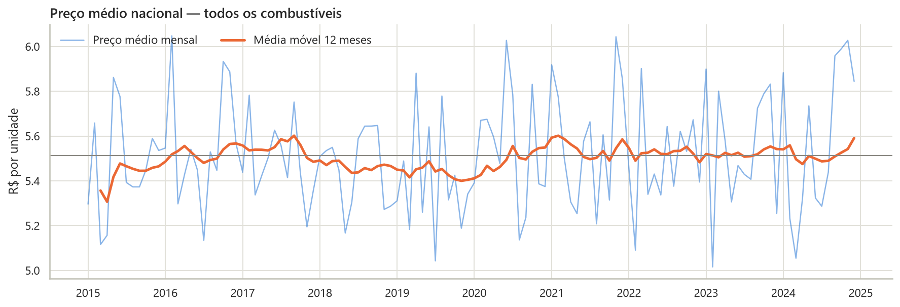

# Variação dos Preços de Combustíveis no Brasil (2015–2024)

Projeto G1 da disciplina **Linguagem de Programação — Análise e Visualização de Dados com Python**.
Análise completa de preços de gasolina, etanol, diesel, GNV e GLP em 20 estados brasileiros, com
tratamento de dados, KPIs, notebook exploratório, banco SQLite, integração com a API do Banco
Central e dashboard interativo em Streamlit.

| Entrega | Link |
|---|---|
| Página do projeto (GitHub Pages) | https://natanbraslavsky.github.io/variacao-preco-combustivel/ |
| Dashboard (Streamlit Cloud) | https://variacao-preco-combustivel.streamlit.app |
| Notebook | [`notebooks/analise_precos_combustiveis.ipynb`](notebooks/analise_precos_combustiveis.ipynb) |
| Código do dashboard | [`app.py`](app.py) · [`pages/`](pages) · [`src/`](src) |
| Base de dados | [`dados/simulacao_precos_combustiveis_brasil.csv`](dados/simulacao_precos_combustiveis_brasil.csv) |



## Perguntas orientadoras

1. Quais estados possuem combustíveis mais caros?
2. Qual combustível apresentou maior aumento?
3. Existem diferenças regionais relevantes?
4. Há períodos de maior instabilidade?
5. Como os preços evoluíram ao longo do tempo?
6. Existe relação entre inflação e combustíveis?
7. Quais combustíveis possuem maior volatilidade?

## Base de dados

- **Principal:** `simulacao_precos_combustiveis_brasil.csv` — 4.440 linhas × 14 colunas, dados mensais
  simulados de 2015 a 2024 ([fonte](https://github.com/AlexandreLouzada/Dados-Simulados-G1)).
- **Externa:** IPCA acumulado em 12 meses, série 13522 do
  [SGS/Banco Central](https://dadosabertos.bcb.gov.br/dataset/13522-indice-nacional-de-precos-ao-consumidor-amplo-ipca---em-12-meses),
  consumida via `requests` (com cópia local em `dados/ipca_bcb_12m.csv` caso a API esteja fora do ar).
- **Geográfica:** contornos dos estados (`dados/brasil_estados.geojson`, simplificado) para o mapa.

## Tratamento dos dados

| Problema encontrado | Tratamento |
|---|---|
| 503 registros repetindo (mês, UF, combustível) com valores diferentes | Consolidação pela média → 3.937 registros |
| `nivel_preco` não acompanha o preço (todas as classes vão de R$ 3 a R$ 8) | Mantida para o filtro + nova `faixa_preco` por quartis |
| `inflacao` e `cotacao_petroleo` variam dentro do mesmo mês | Uso da média mensal nas análises temporais |
| Amostragem desigual (37 de 100 combinações por mês) | Documentada e considerada na interpretação |
| Tipos e textos | Datas convertidas, ano/mês derivados da data, textos padronizados, ordem mín ≤ médio ≤ máx garantida |

**Engenharia de atributos:** `nome_uf`, `trimestre`, `semestre`, `nome_mes`, `periodo`, `amplitude`,
`amplitude_pct`, `direcao`, `variacao_abs`, `faixa_preco`, `zscore_preco`.

## Principais resultados

| KPI | Valor |
|---|---|
| Preço médio nacional | R$ 5,51 |
| Combustível mais caro | GLP (R$ 5,57) |
| Estado com maior preço | Ceará (R$ 5,66) |
| Maior variação mensal | −15,61% (Gasolina · MS · 06/2023) |
| Consumo estimado total | 497,2 milhões |
| Região mais cara | Nordeste (R$ 5,58) |

- Preços **estáveis** em torno de R$ 5,50, sem tendência nem sazonalidade.
- Diferenças entre estados (~6%), regiões e combustíveis são **pequenas** frente à variação interna.
- Gasolina e etanol subiram ~5% entre 2015 e 2024; o diesel caiu ~2%.
- Correlação com inflação e petróleo **≈ 0** (Pearson e Spearman); a inflação simulada não acompanha o IPCA real.
- Conclusão: a base é simulada e não reproduz os mecanismos reais (petróleo, câmbio, ICMS). O pipeline
  é reaproveitável com os dados abertos da ANP.

## Funcionalidades

**Dashboard multipágina** (Visão geral · Evolução temporal · Regiões e estados · Combustíveis ·
Inflação e petróleo · Dados e SQL · Conclusões) com:

- 6 filtros compartilhados: ano, mês, região, estado, combustível e nível de preço;
- 6 KPIs dinâmicos;
- linha temporal, barras por estado e por combustível, heatmap mensal, dispersão inflação × preço,
  tabela dinâmica configurável;
- mapa interativo (Plotly) e matriz de correlação (Seaborn);
- interpretação textual recalculada a cada filtro e conclusão executiva;
- consultas SQL via SQLAlchemy, upload de CSV e download dos dados filtrados.

| Requisito | Implementação |
|---|---|
| Intermediárias | filtros múltiplos, KPIs dinâmicos, gráficos interativos, análise temporal, tratamento avançado, upload de arquivos, seções organizadas, visualizações comparativas, análise geográfica |
| Avançadas | dashboard multipágina · SQLAlchemy + SQLite com modelagem relacional · mapa interativo Plotly · correlação estatística · consumo de API (Requests) · integração de múltiplas fontes (CSV + API + banco) |

### Modelo relacional (`database/combustiveis.db`)

```
regioes (id, nome) 1──N ufs (sigla, nome, regiao_id) 1──N precos (..., uf_sigla, combustivel_id) N──1 combustiveis (id, nome, unidade)
indicadores_bcb (data, ipca_12m)  ← ligada a precos pela data
```

## Estrutura

```
variacao-preco-combustivel/
├── app.py                  # entrada do Streamlit: carga, filtros e navegação
├── pages/                  # páginas do dashboard
├── src/
│   ├── dados.py            # leitura, limpeza, atributos e KPIs (usado no notebook e no app)
│   ├── banco.py            # modelo SQLAlchemy, carga do SQLite e consultas
│   ├── api_bcb.py          # consumo da API do Banco Central
│   └── ui.py               # componentes visuais e paleta
├── requirements.txt
├── README.md
├── index.html              # página do projeto (GitHub Pages)
├── css/style.css           # estilos da página do projeto
├── dados/                  # CSV, IPCA (cache) e GeoJSON
├── database/               # combustiveis.db
├── notebooks/              # analise_precos_combustiveis.ipynb
├── imagens/                # gráficos gerados pelo notebook
└── .streamlit/config.toml  # tema
```

## Como executar

```bash
git clone https://github.com/NatanBraslavsky/variacao-preco-combustivel.git
cd variacao-preco-combustivel
python -m venv .venv
.venv\Scripts\activate          # Windows  (Linux/macOS: source .venv/bin/activate)
pip install -r requirements.txt
streamlit run app.py
```

Para o notebook: `pip install jupyter` e abra `notebooks/analise_precos_combustiveis.ipynb`.

## Tecnologias

Python 3.12 · Pandas · NumPy · Matplotlib · Seaborn · Streamlit · Plotly · SQLAlchemy · SQLite · Requests · GitHub Pages · Streamlit Community Cloud

---
Natan Braslavsky · 2026
